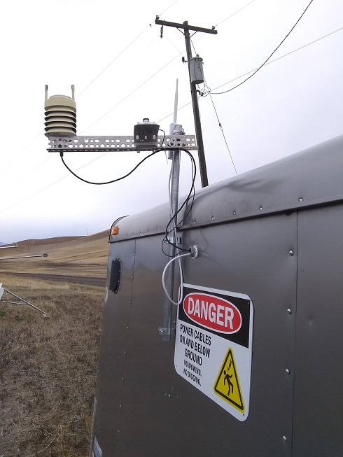
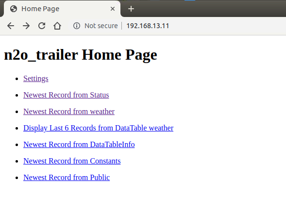

# N2O Flux Trailer Weather Station

Weather station (and communications package) for the [WSU LAR](http://lar.wsu.edu)
N2O flux measurement support trailer.

| | |
|-|-|
|  |  |

## Hardware

Equipment inside a fiberglass enclosure on the trailer wall:

* Battery-backed 12V power supply ([PS100](https://www.campbellsci.com/ps100), Campbell Scientific)
* Programmable datalogger ([CR1000](https://www.campbellsci.com/cr1000), Campbell Scientific)
* Broadband modem ([RV50](https://source.sierrawireless.com/devices/rv-series/rv50/), Sierra Wireless)
* Rugged Ethernet switch ([SW-504](http://www.brainboxes.com/product/sw-504/industrial-ethernet-4-port-switch-din-rail-mountable), Brainboxes)
* Ethernet surge protector ([ETH-SP](https://www.ui.com/accessories/ethernet-surge-protector/), Ubiquiti Networks)
* Wireless access point ([Picostation M2](https://dl.ubnt.com/datasheets/picostationm/picom2hp_DS.pdf), Ubiquiti Networks)

Sensors mounted on a short external mast:

* Total weather station ([WXT510](https://www.campbellsci.com/wxt510), Vaisala)
* Photosynthetically active radation sensor ([LI-190SA](https://www.licor.com/env/products/light/quantum.html), LI-COR Biosciences)
    * *requires [Model 2290 Millivolt Adapter](https://www.licor.com/env/products/light/accessories.html) (LI-COR Biosciences)*

The wireless access point can optionally be deployed outside the trailer on the
external mast to obtain greater wireless coverage. Antennas for the broadband
modem are permanently installed on a short mast at the nose of the trailer.

## Wiring

### Power System

All equipment listed above is powered from the battery-backed 12V power supply.
If primary power is lost, the battery continues to operate the logger, sensors
and communications network for up to several hours.

> *The communications equipment is battery-backed so network clients are still
> able to send email alarms during a power outage.*

### WXT510

The cable used does **not** match either vendor or manufacturer color
conventions. Refer to this table exclusively for wiring the weather station:

| Description    | Color  | M8 conn. pin | CR1000 | Ext. power supply |
|----------------|--------|:------------:|:------:|:-----------------:|
| power input    | brown  | 2            | 12V    | - |
| power ground   | green  | 8            | G      | - |
| cable shield   | bare   | -            | G      | - |
| SDI-12 data Tx | yellow | 7            | C7     | - |
| SDI-12 data Rx | black  | 1            | C7     | - |
| SDI-12 ground  | white  | 3            | G      | - |
| heater (+)     | blue   | 4            | -      | 12V |
| heater (-)     | orange | 6            | -      | G |
| *not used*     | red    | 5            | -      | - |

### QUANTUM (PAR) sensor

The QUANTUM (LI-190SA) sensor connects to the BNC connector of a 2290 (604&ohm;)
millivolt adapter, and the millivolt adapter is measured differentially:

> *The millivolt adapter for LI-190SA series PAR sensor is measured with an
> inverted differential setup. The multiplier is also negative, which produces
> a positive value.*

| Description  | Color | CR1000 |
|----------------------------------------|:-----:|:-----:|
| Model 2290 Millivolt adapter, negative | blue  | DF1 H |
| Model 2290 Millivolt adapter, positive | green | DF1 L |
| *jumper to CR1000 DF 1L port*          | green | &#x23DA; |

### Door switch

The magnetic reed switch door sensor is powered by the logger and connected to
a control port. 

| Description | CR1000 |
|-------------|:------:|
| wire #1     | 5V     |
| wire #2     | C8     |

## Operation

### To deploy the sensors

The weather station and PAR sensor (with leveling mount) are attached to a short
length of aluminum slotted angle framing. This entire assembly must be removed
during travel, then installed and oriented at each new location.

To deploy the sensor mounting arm:

1. Slip the mounting arm U-bolt over the instrument mast and secure loosely.
2. Orient the mounting arm away from the equator (e.g. northward) to prevent
   shading the radiation sensor.
   > *The azimuth orientation of the weather station must be measured and
   > specified in the logger program after installation. The default azimuth
   > value (0) assumes the WXT510 is oriented towards True North.*
3. Tilt the mounting arm, as needed, to level the weather station.
4. Secure the mounting arm U-bolt.
5. Make final adjustments to the PAR sensor bracket to obtain a level position.
6. Feed the PAR sensor cable through the wall port, into the logger enclosure,
   and attach to BNC jack of millivolt adapter.
7. Feed the weather station data cable out of the logger enclosure, through the
   wall port, and attach to the weather station.
8. Inside the logger enclosure, turn the power supply switch to *ON*.

To remove, perform the installation procedure in reverse. 

> *It is not necessary or recommended to remove the weather station or PAR
> sensor and bracket from the mounting arm. The weather station cable and
> millivolt adapter for PAR sensor remain in the logger enclosure.*

### To update constants

Users can modify program constants to reflect sensor or location changes:
* `UTC_OFFSET` - time offset relative to UTC, in hours (default: `-8` = Pacific
  Standard Time)
* `WXT_AZIMUTH` - orientation of the weather station w.r.t. True North, in
  degrees (default: `0` = True North)
* `PAR_MULT` - unique sensor-specific calibration value, in
  &micro;mol/(mV s m2) (default: `0` = *no data*)
  *This value should be negative*

To edit these values, users have several options:

* Locally, using a [keyboard display](https://www.campbellsci.com/cr1000kd)
  (not provided) to edit the `ConstTable`
* Over the local area network, using [LoggerLink](https://www.campbellsci.com/loggerlink)
  to edit the public table `Constants` (recommended option)
* Remotely (not described here), using [LoggerNet Connect](https://campbellsci.com/loggernet)
  to edit the public table `Constants`

Refer to vendor documentation for logger setup details. When connected to the
network locally (wired or wireless) the logger can be accessed via:

* IP address: `192.168.13.11`
* Pakbus port: `6785`

### To view data

To view data, use any of the methods mentioned above (LoggerLink, etc) or
visit the datalogger's IP address with a web browser. A default
webpage allows visitors to explore recent records (screenshot below). 

You must be connected to the trailer's local area network (wired or wireless)
to view the logger webpage.

### To download data

To download data, use logger support software (LoggerLink or LoggerNet) or use
the Web API (details in *CRBasic Editor Help*).

For example, to download the last ~7.5 days (11,000 minutes) in TOA5 format
(CSV+headers) using the Web API, visit:

> [http://192.168.13.11/?command=dataquery&uri=weather&format=toa5&mode=most-recent&p1=11000](http://192.168.13.11/?command=dataquery&uri=weather&format=toa5&mode=most-recent&p1=11000)

You must be connected to the trailer's local area network (wired or wireless)
to access the logger Web API.

## Data Products

The weather station internally produces 1-minute average values, and the logger
queries for those values and samples other sensors at the start of each minute.
A single data file is written to CompactFlash memory card:

* Base name: `weather`
* Record interval: 1 minute
* Number of records: up to 365 days
* Fill-stop settings: "ring" mode - overwrites oldest records when memory fills

| Field name     | Units   | Description |
|----------------|---------|-------------|
| WindDir_min    | degrees | Wind direction, minimum |
| WindDir_avg    | degrees | Wind direction, average |
| WindDir_max    | degrees | Wind direction, maximum |
| WindSpeed_min  | m/s     | Wind speed, minimum |
| WindSpeed_avg  | m/s     | Wind speed, average |
| WindSpeed_max  | m/s     | Wind speed, maximum |
| Tmpr           | degC    | Air temperature |
| RH             | percent | Relative humidity |
| Press          | hPa     | Barometric pressure |
| Rain_amt       | mm      | Rain, amount |
| Rain_dur       | sec     | Rain, duration |
| Rain_int       | mm/hr   | Rain, intensity |
| Hail_amt       | mm      | Hail, amount |
| Hail_dur       | sec     | Hail, duration |
| Hail_int       | mm/hr   | Hail, intensity |
| HeaterTmpr     | degC    | Heating sensor temperature |
| HeaterVolts    | Vdc     | Heater input voltage1 |
| PAR_density    | umol/(s m^2) | Photosynthetic photon flux density (PPFD), approximately2 |
| LoggerTmpr     | degC    | Logger enclosure temperature |
| PowerIn        | Vdc     | Power supply voltage3 |
| DoorOpen       | Boolean | Status of trailer door: 0 = closed, -1 = open4 |
| ClockError     | msec    | Measured clock offset from UTC5 |
| UTC_OFFSET     | hours   | Timestamp offset from UTC6 |
| WXT_AZIMUTH    | degrees | Azimuth correction applied to WXT510 wind direction values7 |
| PAR_MULT       | umol/(mV s m^2) | Calibration multiplier used with PAR sensor8 |

*Footnotes:*

1. *Available, not applied, heating voltage (should be same value as `PowerIn`).
   Refer to WXT510 user manual for heater operation details.*
2. *Approximately because logger is configured for use with older
   (uncalibrated) LI-190SA series PAR sensors.*
3. *Unregulated voltage from battery, typically >12.8 Vdc when a charging source
   (AC utility power) is available.*
4. *Value will be NAN until sensor is installed.*
5. *[Network time protocol](https://en.wikipedia.org/wiki/Network_Time_Protocol)
   offset relative to `0.us.pool.ntp.org`.*
6. *Default value `-8` = Pacific Standard Time (i.e. no adjustments made for
   Daylight Savings Time).*
7. *Recorded wind direction min/avg/max values include this constant offset value*  
   (i.e. `WindDir``avg` = `(WindDir``avg,measured``) + WXT_AZIMUTH MOD 360`).
8. *Value will be negative when used with LI-190SA series PAR sensors.*

## Configuration Summary

Use the Vaisala WXT Configuration Tool to modify settings as follows:

* Device Settings
  * Enable heating
  * SDI-12 v1.3, continuous mode enabled
* Message Settings
  * All wind messages
  * *Barometric pressure*, *Air temperature* and *Relative humidity* PTU messages
  * All precipitation messages, except *Rain peak* and *Hail peak*
  * *Heating temp.* and *Heating voltage* diagnostic/supervisor messages
* Sensor Settings
  * Wind speed unit: m/s
  * Temperature unit: Celsius
  * Barometric pressure unit: hPa
  * Counter reset: Automatic
  * Rain unit: Metric
  * Auto report based on: Rain start/end
  * Direction correction: 0&deg;
  * Averaging time for all sensors: 1 min
  * Update interval for all sensors: 1 min

## Licensing

* Original software contributions are licensed under [The MIT License](https://opensource.org/licenses/MIT). 
* Documentation, including images, are licensed under [CC-BY-SA-4.0](https://creativecommons.org/licenses/by-sa/4.0/) (Creative Commons Attribution-ShareAlike 4.0 International).
* This work derived from [*Compost WXT520 Logger Program*](https://github.com/patricktokeeffe/compost-wxt520),
  which is also subject to The MIT License.

## References

* Campbell Scientific. *HMP45C Temperature and Relative Humidity Probe Instruction Manual.*
  Revision [03/09](http://web.archive.org/web/20180517103656/s.campbellsci.com/documents/us/manuals/hmp45c.pdf)
  Online: <https://s.campbellsci.com/documents/us/manuals/hmp45c.pdf>

* Campbell Scientific. *GPS16X-HVS GPS Receiver Instruction Manual.*
  Revision [9/15](http://web.archive.org/web/20191026023811/http://s.campbellsci.com/documents/ca/manuals/gps16x-hvs_man.pdf).
  Online: <https://s.campbellsci.com/documents/ca/manuals/gps16x-hvs_man.pdf>

* Campbell Scientific. *WXT510 Weather Transmitter Instruction Manual.*
  Revision [4/07](http://web.archive.org/web/20191025233109/https://s.campbellsci.com/documents/us/manuals/wxt510.pdf).
  Online: <https://s.campbellsci.com/documents/us/manuals/wxt510.pdf>

* LI-COR Biosciences. *LI-190SA Quantum Sensor Datasheet.*
  Modified date [2009-11-11T13:32:49](http://web.archive.org/web/20191029220540/https://www.licor.com/env/pdf/light/190.pdf).
  Online: <https://www.licor.com/env/pdf/light/190.pdf>

* LI-COR Biosciences. *Terrestrial Quantum Sensors Instruction Manual.*
  Build date [Thursday, May 23, 2019](http://web.archive.org/web/20191026023428/https://www.licor.com/documents/oo6v1v8bbtoxbd7o299u6a503g32w3g5).
  Online: <https://www.licor.com/documents/oo6v1v8bbtoxbd7o299u6a503g32w3g5>

* LI-COR Biosciences. *Using LI-COR's Millivolt Adapters for Interfacing LI-COR
  Radiation Sensors to Voltage-reading Dataloggers.*
  [Modified 2011-11-04T15:37:35](http://web.archive.org/web/20191029221011/https://www.licor.com/documents/tnn0vl9t8ukt1y9x26qc).
  Online: <https://www.licor.com/documents/tnn0vl9t8ukt1y9x26qc>

* O'Keeffe, Patrick. *Compost WXT520 Logger Program.*
  [Retrieved 2019-10-25](https://github.com/patricktokeeffe/compost-wxt520/commit/0e3ad20997b60249bfd563e00267422574ed0416).
  Online: <https://github.com/patricktokeeffe/compost-wxt520>

* Vaisala Oyj. *Vaisala HUMICAP&reg; Humidity and Temperature Probes User's Guide.*
  Revision [2006](http://web.archive.org/web/20190515162841/www.vaisala.com/sites/default/files/documents/HMP45AD-User-Guide-U274EN.pdf).
  Online: <https://www.vaisala.com/sites/default/files/documents/HMP45AD-User-Guide-U274EN.pdf>

* Vaisala Oyj. *Vaisala Weather Transmitter WXT510 User's Guide.*
  Revision [2006](http://web.archive.org/web/20180116043159/https://www.vaisala.com/sites/default/files/documents/WXT510_User_Guide_in_English.pdf).
  Online: <https://www.vaisala.com/sites/default/files/documents/WXT510_User_Guide_in_English.pdf>

